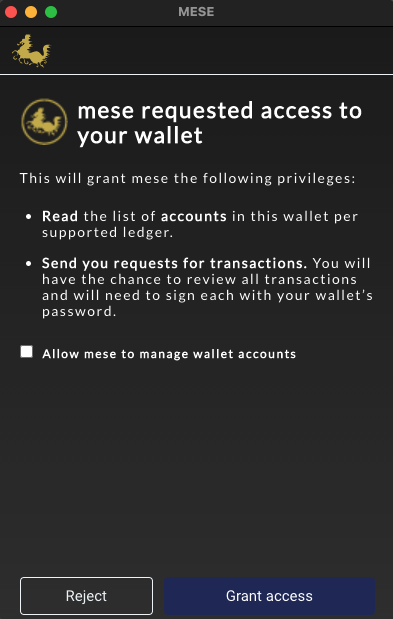

# MESE

# Integrating MESE to add Transaction Capabilities for DApps on Algorand

MESE injects a JavaScript library into every web page the browser user visits, which allows the site to interact with the extension. The DApp can use the injected library to connect to the user's Wallet, discover account addresses it holds, query the Network (make calls to AlgoD v2 or the Indexer) and request MESE to request for the user to sign a transaction initiated by the application. **All methods of the injected library return a Promise that needs to be handled by the DApp.**

## Methods

- [MESE.version()](#meseversion)
- [MESE.connect({name: `DApp-Name`, ledger: `MainNet`})](#meseconnectname-dapp-name-ledger-mainnet)
- [MESE.disconnect()](#mesedisconnect)
- [MESE.accounts({ ledger: ‘MainNet’ })](#meseaccounts-ledger-mainnet-)
- [MESE.DAppAccounts({ name: `DApp-Name`, ledger: ‘MainNet’ })](#mesedappaccounts-name-dapp-name-ledger-mainnet-)
- [MESE.AccountAssets({ ledger: `MainNet`, address: ‘Account Address })](#meseaccountassets-ledger-mainnet-address-address-)
- [MESE.CreateMnemonic({ ledger: ‘MainNet’ })](#mesecreatemnemonic-ledger-mainnet-)
- [MESE.CreateAccount({ name: `Account Name`, ledger: ‘MainNet’, mnemonic: `Account Mnemonic`, address: `Account Address`})](#mesecreateaccount-name-account-name-ledger-mainnet-mnemonic-account-mnemonic-address-account-address)
- [MESE.algod({ ledger: ‘MainNet’, path: ‘algod v2 path’, ... })](#mesealgod-ledger-mainnet-path-algod-v2-path-)
- [MESE.indexer({ ledger: ‘MainNet’, path: ‘indexer v2 path’ })](#meseindexer-ledger-mainnet-path-indexer-v2-path-)
- [MESE.signTxn([txnObjects,...])](#mesesigntxntxnobjects)
- [MESE.send({ ledger: ‘MainNet’, txBlob })](#mesesend-ledger-mainnet-txblob-)
- [MESE.sign(txnObject)](#mesesigntxnobject)
  - [Transaction Requirements](#transaction-requirements)
  - [Atomic Transactions](#atomic-transactions)
- [MESE.signMultisig(txn)](#mesesignmultisigtxn)
- [MESE.AddNetwork({name: `LedgerName`, genesisId: `genesisId`, symbol: `LedgerSymbol`, algodUrl: `algodUrl`, indexerUrl: `indexerUrl`, headers: `headers`, baseUrl: `baseUrl`})](#meseaddnetworkname-ledgername-genesisid-genesisid-symbol-ledgersymbol-algodurl-algodurl-indexerurl-indexerurl-headers-headers-baseurl-baseurl)
- [MESE.DeleteNetwork({name: `LedgerName`})](#mesedeletenetworkname-ledgername)

## Misc

[Rejection Messages](#rejection-messages)

[Working with Custom Networks](#custom-networks)

[Helper Functions](#helper-functions)

## Method Details

### MESE.version()

Returns MESE Wallet extension version user uses.

**Request**

```js
MESE.version().then((res) => console.log(res));
```

**Response**

```json
{
  "version": "1.6.1"
}
```

### MESE.connect({name: `DApp-Name`, ledger: `MainNet`})

Requests access to the Wallet for the DApp, may be rejected or approved. Every access to the extension begins with a connect request, which if approved by the user, allows the DApp to follow-up with other requests.

#### DApp managed accounts

_DApp Managed accounts_ functionality helps wallet users to avoid doing some work on the wallet. This work might be needed at some point when an account reaches the limitation in Algorand. For example, accounts can only opt into 50 stateful contracts. If your DApp allows accounts to opt into many contracts, it might be troublesome to create a new account each time the limit is reached and transfer all your Algo/ASA amounts from the previous account.

DApp managed accounts does that for you. Once the limit is reached for the first managed account (we call it master account), the wallet automatically creates a new managed _sub-account_ in the background and does the [Rekey](https://developer.algorand.org/docs/features/accounts/rekey/#create-publication-overlay) back to master account. That way, newly created _sub-account_ will be interacting with stateful contracts, all transactions will be signed by the master account and same time it will maintain one static public address. Thus, MESE wallet will always have one deposit address for Algo. Although, assets might have different deposit addresses, depending on which Managed _sub-account_ holds that asset.

DApp managed accounts also moves balances between master/sub-accounts to ensure that the current MESE Managed account would always have a sufficient amount to initiate the transaction. It's also possible that managed accounts will do opt in to assets in the background if needed. With the current implementation, while switching from one Managed account to another, MESE Wallet only keeps the minimum Algo amount for the account. 

DApp managed accounts also have abilities to change the incoming transaction addresses to the appropriate address. For example, if an account inside the managed accounts has already interacted with a pool/contract, but the incoming transaction gives a wrong account address when interacting with the contract, then managed account will change the transactions to use the account that has already interacted with the contract previously. With this ability, the system/user can safely rely on using one single master account address for doing all transactions that will happen. Note that this ability only works for the managed account.


##### Allow MESE Wallet to use Managed accounts

User will have an option (by checking the checkbox) to allow MESE wallet to use dPP Managed account, while connecting to the wallet. If the DApp name hasn't been already specified before on the selected URL origin, then the checkbox for creating a managed account will exist. In other words, if _master_ DApp Managed account already exists for this DApp, the check box will not appear. If user checks the checkbox, then a new DApp Managed account named with a specified name will be automatically created. If users did not check the checkbox, then there'll be no new managed account.



### MESE.disconnect()

Disconnect the wallet extension connection from the origin that requests the function.

**Request**

```js
MESE.disconnect().then().catch();
```

**Response**

```json
{
  "message": "https://origin.com disconnected"
}
```

### MESE.accounts({ ledger: ‘MainNet’ })

Returns an array of accounts present in the Wallet for the given Network.

**Request**

```js
MESE.accounts({ ledger: 'MainNet' });
```

**Response**

```json
[
  {
    "address": "U2VHSZL3LNGATL3IBCXFCPBTYSXYZBW2J4OGMPLTA4NA2CB4PR7AW7C77E"
  },
  {
    "address": "MTHFSNXBMBD4U46Z2HAYAOLGD2EV6GQBPXVTL727RR3G44AJ3WVFMZGSBE"
  }
]
```

### MESE.DAppAccounts({ name: `Dapp-Name`, ledger: ‘MainNet’ })

Returns a Dex account with its sub-accounts in the Wallet for the given Network.

**Request**

```js
MESE.DAppAccounts({ name: 'MESE DEX', ledger: 'MainNet' }).then().catch();
```

**Response**

```json
{
  "master_account": {
    "address": "U2VHSZL3LNGATL3IBCXFCPBTYSXYZBW2J4OGMPLTA4NA2CB4PR7AW7C77E",
    "name": "MESE Dex"
  },
  "sub_accounts": [
    {
      "address": "MTHFSNXBMBD4U46Z2HAYAOLGD2EV6GQBPXVTL727RR3G44AJ3WVFMZGSBE",
      "name": "MESE Dex-1"
    }
  ],
  "url": "https://mese.io"
}
```

### MESE.AccountAssets({ ledger: ‘MainNet’, address: `address` })

Returns assets for specified address. If the requested address is a dex managed account, then it'll automatically check the total number of opted in apps from the active account.

If the total number of opted in apps reachs 7, then a function will automatically create a new DApp sub-account and saved it into the chrome storage with the 'DApp*pools' key under the \_sub_accounts* object. Note that all the sub-accounts that have been created are not visible to the users. Only the master accounts that visible to the users (the accounts that have been created using `MESE.connect()`).

If the total number of opted in apps reachs 50, then switching happens: all ALGO balances from the master account or active account will be transferred to the latest inactive _sub-account_, leaving the minimum ALGO balance. Then, Set the Latest Managed _sub-accounts_ to be an Active Managed Account by setting an "active" key in the 'DApp-pools' storage with a boolean value.

**Request**

```js
MESE.AccountAssets({
  ledger: 'MainNet',
  address: 'GS3TSGDI2RMR4NCAEJ6AHCKKOU4HPB4M27HC5M3H6GYKRU7ZVHN4MOARDM',
})
  .then()
  .catch();
```

**Response for regular accounts / DApp accounts that don't need a special treat (create/switch sub-account)**

```json
{
  assets: {
    algoPrice: 0.83,
    assets: [{...}],
    pendingAlgos: 0,
    totalAlgo: 124017405
  },
  dex: null
}
```

**Response for DApp accounts that have reached 7 opted in apps (create sub-account)**

```json
{
  assets: {
    algoPrice: 0.83,
    assets: [{...}],
    pendingAlgos: 0,
    totalAlgo: 124017405
  },
  dex: {
    create: [
      {
        address: "BPY5MXQYTX7HPXWFJ225TILKIDKOCPXSH2JDHNKNQTA4XXCADTEV3NTTBQ"
      },
      {
        txId: "TFEKEF7FDTBQBL7U5MA5A4MFDMUD2B7VVQFFRELSPXFSCVEC76NQ"
      }
    ]
  }
}
```

**Response for DApp accounts that have reached 10 opted in apps (switch sub-account)**

```json
{
  assets: {
    algoPrice: 0.83,
    assets: [{...}],
    pendingAlgos: 0,
    totalAlgo: 124017405
  },
  dex: {
    active_address: "57TD6NEOH4ERABUCBT6L7LO3PG326BJJFWDH56JVU7CKOEZBO6OJ7LEKTY"
  }
}
```

### MESE.CreateMnemonic({ ledger: ‘MainNet’ })

Returns an object with address & mnemonic words. The returned values will be used for the next request, which is the `MESE.CreateAccount()`.

**Request**

```js
MESE.CreateMnemonic({ ledger: 'MainNet' });
```

**Response**

```json
{
  "address": "U2VHSZL3LNGATL3IBCXFCPBTYSXYZBW2J4OGMPLTA4NA2CB4PR7AW7C77E",
  "mnemonic": "random glass nuclear loud float settle hire travel project mango image country goddess deputy nose winter peace stadium street village stage fresh thumb abstract improve"
}
```

### MESE.CreateAccount({ name: `Account Name`, ledger: ‘MainNet’, mnemonic: `Account Mnemonic`, address: `Account Address`})

Creating an account with retrieved address & mnemonic words, from the `MESE.CreateMnemonic()`.

**Request**

```js
MESE.CreateAccount({
  ledger: 'MainNet',
  name: 'New Account',
  mnemonic:
    'mandate primary yellow cancel camera emerge genre response page relax half file decorate stove goose resource faculty magnet absurd depart enroll arena pyramid above shiver',
  address: 'QGCSQ73UHOW4IDOSX3OV75TTZ4MKOTNMF33OQMGTIXWNMSCVJL3EGPX7ZE',
});
```

**Response**

```json
  {
    "MainNet": [{...}, {...}]
  }
```

## [API Calls](#api-calls)

Developers may use MESE's connection to Algorand and Indexer API services. This is an optional convienance, DApps may establish their own connections to retrieve parameters, query the Indexer, and send transactions to the chain.

Proxied requests are passed through to an API service - currently set to the MESE API service. Endpoints available are limited to what the service exposes. The API backend may be configured by advanced users and is not guaranteed to respond as expected. Only text responses are supported for this service (not message packed).

### MESE.algod({ ledger: ‘MainNet’, path: ‘algod v2 path’, ... })

Proxies the requested path to the Algod v2 API. Is limited to endpoints made available by the API server. By default, all calls to the MESE.algod method are GET.

**Request (GET)**

```js
MESE.algod({
  ledger: 'MaintNet',
  path: '/v2/transactions/params',
});
```

**Response**

```json
{
  "consensus-version": "https://github.com/algorandfoundation/specs/tree/e5f565421d720c6f75cdd186f7098495caf9101f",
  "fee": 1,
  "genesis-hash": "SGO1GKSzyE7IEPItTxCByw9x8FmnrCDexi9/cOUJOiI=",
  "genesis-id": "mainnet-v1.0",
  "last-round": 8271323,
  "min-fee": 1000
}
```

To make a POST requests, more details need to be included in as input. More information can be found [here](https://developer.algorand.org/docs/reference/rest-apis/algod/v2/).

**Request (POST)**

```js
MESE.algod({
  ledger: 'MainNet',
  path: '/v2/teal/compile',
  body: 'int 0',
  method: 'POST',
  contentType: 'text/plain',
});
```

**Response**

```json
{
  "hash": "KI4DJG2OOFJGUERJGSWCYGFZWDNEU2KWTU56VRJHITP62PLJ5VYMBFDBFE",
  "result": "ASABACI="
}
```

### MESE.indexer({ ledger: ‘MainNet’, path: ‘indexer v2 path’ })

Proxies the requested path to the Indexer v2 API. Is limited to endpoints made available by the API server. The API backend may be configured by advanced users and is not guaranteed to respond as expected. More information can be found [here](https://developer.algorand.org/docs/reference/rest-apis/algod/v2/).

**Request**

```js
MESE.indexer({
  ledger: 'MainNet',
  path: '/v2/assets/150821',
});
```

**Response**

```json
{
  "asset": {
    "index": 150821,
    "params": {
      "clawback": "Q2SLSQTBMVJYVT2AANUAXY4A5G7A3Y6L2M6L3WIXKNYBTMMQFGUOQGKSRQ",
      "creator": "Q2SLSQTBMVJYVT2AANUAXY4A5G7A3Y6L2M6L3WIXKNYBTMMQFGUOQGKSRQ",
      "decimals": 15,
      "default-frozen": false,
      "freeze": "Q2SLSQTBMVJYVT2AANUAXY4A5G7A3Y6L2M6L3WIXKNYBTMMQFGUOQGKSRQ",
      "manager": "Q2SLSQTBMVJYVT2AANUAXY4A5G7A3Y6L2M6L3WIXKNYBTMMQFGUOQGKSRQ",
      "name": "decimal Test",
      "reserve": "Q2SLSQTBMVJYVT2AANUAXY4A5G7A3Y6L2M6L3WIXKNYBTMMQFGUOQGKSRQ",
      "total": 1000,
      "unit-name": "dectest"
    }
  },
  "current-round": 8271410
}
```

## Working with Transactions

Sent in transactions will be validated against the Algorand JS SDK transaction types - field names must match, and the whole transaction will be rejected otherwise.

This section covers the new v2 Signing. Additional end-to-end examples will be included in the next weeks.

### MESE.signTxn([txnObjects,...])

Send transaction objects, conforming to the Algorand JS SDK, to MESE for approval. The Network is determined from the 'genesis-id' property. If approved, the response is an array of signed transaction objects, with the binary blob field base64 encoded to prevent transmission issues.

**_Request_**

```
let signedTxs = await MESE.signTxn([
  {
    txn: base64MultisigTx,
  },
  {
    txn: base64MultisigTx,
    authAddr: 'Auth-Addr Address' // Optional
  },
]);
```

#### Transaction Requirements

Transactions objects need to be presented with the following structure:

```
{
  txn: Base64-encoded string of a transaction binary,
  signers?: [optional] array of addresses to sign with (defaults to the sender),
  multisig?: [optional] extra metadata needed for multisig transactions,
};
```

In order to facilitate conversion between different formats and encodings, [helper functions](#helper-functions) are available on the `MESE.encoding.*` namespace.

Also available on transactions built with the JS SDK is the `.toByte()` method that converts the SDK transaction object into it's binary format.

**Request**

```js
MESE.signTxn([
  {
    txn: 'iqNhbXRko2ZlZc0D6KJmds4A259Go2dlbqx0ZXN0bmV0LXYxLjCiZ2jEIEhjtRiks8hOyBDyLU8QgcsPcfBZp6wg3sYvf3DlCToio2dycMQgdsLAGqgrtwqqQS4UEN7O8CZHjfhPTwLHrB1A2pXwvKGibHbOANujLqNyY3bEIK0TEDcptY0uFvk2V5LDVzRfdz7O4freYHEuZbpI+6hMo3NuZMQglmyhKUPeU2KALzt/Jcs0GQ55k2vsqZ4pGeNlzpnYLbukdHlwZaNwYXk=',
  },
]);
```

**NOTE:** Even though the method accepts an array of transactions, it requires atomic transactions with groupId and will error on non-atomic groups.

**Response**

```json
[
  {
    "txID": "4F6GE5EBTBJ7DOTWKA3GK4JYARFDCVR5CYEXP6O27FUCE5SGFDYQ",
    "blob": "gqNzaWfEQL6mW/7ss2HKAqsuHN/7ePx11wKSAvFocw5QEDvzSvrvJdzWYvT7ua8Lc0SS0zOmUDDaHQC/pGJ0PNqnu7W3qQKjdHhuiaNhbXQGo2ZlZc4AA7U4omZ2zgB+OrujZ2VurHRlc3RuZXQtdjEuMKJnaMQgSGO1GKSzyE7IEPItTxCByw9x8FmnrCDexi9/cOUJOiKibHbOAH4+o6NyY3bEIHhydylNDQQhpD9QdKWejLCMBgb5UYJTGCfDW3KgLsI+o3NuZMQgZM5ZNuFgR8pz2dHBgDlmHolfGgF96zX/X4x2bnAJ3aqkdHlwZaNwYXk="
  }
]
```

**Example**

```js
await MESE.connect();

// Create an Algod client to get suggested transaction params
let client = new algosdk.Algodv2(token, server, port, headers);
let suggestedParams = await client.getTransactionParams().do();

// Use the JS SDK to build a Transaction
let sdkTx = new algosdk.Transaction({
  to: 'RECEIVER_ADDRESS',
  from: 'SENDER_ADDRESS',
  amount: 100,
  ...suggestedParams,
});

// Get the binary and base64 encode it
let binaryTx = sdkTx.toByte();
let base64Tx = MESE.encoding.msgpackToBase64(binaryTx);

let signedTxs = await MESE.signTxn([
  {
    txn: base64Tx,
  },
]);
```

The signed transactions can then be sent using the SDK (example below) or using the [MESE.send()](#mesesend-ledger-mainnet-txblob-) method.

```js
// Get the base64 encoded signed transaction and convert it to binary
let binarySignedTx = MESE.encoding.base64ToMsgpack(signedTxs[0].blob);

// Send the transaction through the SDK client
await client.sendRawTransaction(binarySignedTx).do();
```

#### Atomic Transactions

For Atomic transactions, provide an array of transaction objects with the same group ID, _provided in the same order as when the group was assigned_.

**Example**

```js
let tx1 = new algosdk.Transaction({
  to: 'SECOND_ADDRESS',
  from: 'FIRST_ADDRESS',
  amount: 100,
  ...suggestedParams,
});
let tx2 = new algosdk.Transaction({
  to: 'FIRST_ADDRESS',
  from: 'SECOND_ADDRESS',
  amount: 100,
  ...suggestedParams,
});

// Assign a Group ID to the transactions using the SDK
algosdk.assignGroupID([tx1, tx2]);

let binaryTxs = [tx1.toByte(), tx2.toByte()];
let base64Txs = binaryTxs.map((binary) => MESE.encoding.msgpackToBase64(binary));

let signedTxs = await MESE.signTxn([
  {
    txn: base64Txs[0],
  },
  {
    txn: base64Txs[1],
  },
]);
```

The signed transaction array can then be sent using the SDK.

```js
let binarySignedTxs = signedTxs.map((tx) => MESE.encoding.base64ToMsgpack(tx.blob));
await client.sendRawTransaction(binarySignedTxs).do();
```

In case not all group transactions belong to accounts on MESE, you can set the `signers` field of the transaction object as an empty array to specify that it's only being sent to MESE for reference and group validation, not for signing.

_MESE.signTxn()_ will return _null_ in it's response array for the positions were reference transactions were sent.

In these cases, you'd have to sign the missing transaction by your own means before it can be sent (by using the SDK, for instance).

```js
let tx1 = new algosdk.Transaction({
  to: 'EXTERNAL_ACCOUNT',
  from: 'ACCOUNT_IN_MESE',
  amount: 100,
  ...suggestedParams,
});
let tx2 = new algosdk.Transaction({
  to: 'ACCOUNT_IN_MESE',
  from: 'EXTERNAL_ACCOUNT',
  amount: 100,
  ...suggestedParams,
});

algosdk.assignGroupID([tx1, tx2]);
let binaryTxs = [tx1.toByte(), tx2.toByte()];
let base64Txs = binaryTxs.map((binary) => MESE.encoding.msgpackToBase64(binary));

let signedTxs = await MESE.signTxn([
  {
    txn: base64Txs[0],
  },
  {
    // This tells MESE that this transaction is not meant to be signed
    txn: base64Txs[1],
    signers: [],
  },
]);
```

Signing the remaining transaction with the SDK would look like this:

```js
// The MESE.signTxn() response would look like '[{ txID, blob }, null]'
// Convert first transaction to binary from the response
let signedTx1Binary = MESE.encoding.base64ToMsgpack(signedTxs[0].blob);
// Sign leftover transaction with the SDK
let externalAccount = algosdk.mnemonicToSecretKey('EXTERNAL_ACCOUNT_MNEMONIC');
let signedTx2Binary = tx2.signTxn(externalAccount.sk);

await client.sendRawTransaction([signedTx1Binary, signedTx2Binary]).do();
```

Alternatively, if you're using the [MESE.send()](#mesesend-ledger-mainnetMainNet-txblob-) to send the transaction, you have to merge the binaries before converting to a base64 encoded string.

```js
// Merge transaction binaries into a single Uint8Array
let combinedBinaryTxns = new Uint8Array(signedTx1Binary.byteLength + signedTx2Binary.byteLength);
combinedBinaryTxns.set(signedTx1Binary, 0);
combinedBinaryTxns.set(signedTx2Binary, signedTx1Binary.byteLength);

// Convert the combined array values back to base64
let combinedBase64Txns = MESE.encoding.msgpackToBase64(combinedBinaryTxns);

await MESE.send({
  ledger: 'MainNet',
  tx: combinedBase64Txns,
});
```

### Multisig Transactions

For Multisig transactions, an additional metadata object is required that adheres to the [Algorand multisig parameters](https://developer.algorand.org/docs/features/accounts/create/#how-to-generate-a-multisignature-account) structure when creating a new multisig account:

```js
{
  version: number,
  threshold: number,
  addrs: string[]
}
```

`MESE.signTxn()` will validate that the resulting multisig address made from the provided parameters matches the sender address and try to sign with every account on the `addrs` array that is also on MESE.

**NOTE:** `MESE.signTxn()` only accepts unsigned multisig transactions. In case you need to add more signatures to partially signed multisig transactions, please use the SDK.

**Example**

```js
let multisigParams = {
  version: 1,
  threshold: 1,
  addrs: ['FIRST_ADDRESS', 'SECOND_ADDRESS', 'ADDRESS_NOT_IN_MESE'],
};

let multisigAddress = algosdk.multisigAddress(multisigParams);

let multisigTx = new algosdk.Transaction({
  to: 'RECEIVER_ADDRESS',
  from: multisigAddress,
  amount: 100,
  ...suggestedParams,
});

// Get the binary and base64 encode it
let binaryMultisigTx = multisigTx.toByte();
let base64MultisigTx = MESE.encoding.msgpackToBase64(binaryMultisigTx);

// This returns a partially signed Multisig Transaction with signatures for FIRST_ADDRESS and SECOND_ADDRESS
let signedTxs = await MESE.signTxn([
  {
    txn: base64MultisigTx,
    msig: multisigParams,
  },
]);
```

In case you want to specify a subset of addresses to sign with, you can add them to the `signers` list on the transaction object, like so:

```js
// This returns a partially signed Multisig Transaction with signatures for SECOND_ADDRESS
let signedTxs = await MESE.signTxn([
  {
    txn: base64MultisigTx,
    msig: multisigParams,
    signers: ['SECOND_ADDRESS'],
  },
]);
```

### MESE.send({ ledger: ‘MainNet’, txBlob })

Send a base64 encoded signed transaction blob to MESE to transmit to the Network.

**Request**

```js
MESE.send({
  ledger: 'MainNet',
  tx: signedTx.blob,
});
```

**Response**

```json
{ "txId": "OKU6A2QYMRSZAUEJUZL3PW5XKLTA6TKWQHIIBXDCO3KT5OHCULBA" }
```

## Custom Networks

- MESE.accounts(ledger) has changed such that calls now accept names that have been added to the user's custom network list as valid ledger names.
  - A non-matching ledger name will result in a error:
    - [RequestErrors.UnsupportedLedger] The provided ledger is not supported.
  - An empty request will result with an error:
    - Ledger not provided. Please use a base ledger: [MainNet,MainNet] or an available custom one [{"name":"Theta","genesisId":"thetanet-v1.0"}].
- Transaction requests will require a valid matching "genesisId", even for custom networks.

## Rejection Messages

The DApp may return the following errors in case of users rejecting requests, or errors in the request:

```
    NotAuthorized = '[RequestErrors.NotAuthorized] The extension user does not authorize the request.',
    InvalidTransactionParams = '[RequestErrors.InvalidTransactionParams] Invalid transaction parameters.',
    UnsupportedAlgod = '[RequestErrors.UnsupportedAlgod] The provided method is not supported.',
    UnsupportedLedger = '[RequestErrors.UnsupportedLedger] The provided ledger is not supported.',
    Undefined = '[RequestErrors.Undefined] An undefined error occurred.',
```

Errors may be passed back to the DApp from the Algorand JS SDK if a transaction is valid, but has some other issue - for example, insufficient funds in the sending account.

### MESE.sign(txnObject)

Send a transaction object, conforming to the Algorand JS SDK, to MESE for approval. The Network is determined from the 'genesis-id' property. If approved, the response is a signed transaction object, with the binary blob field base64 encoded to prevent transmission issues.

#### Transaction Requirements

- Must have a valid type ('pay', 'keyreg', 'acfg', 'axfer', 'afrz', 'appl')
- Must not have additional unknown fields
- Must not have any value in the 'rekey' field
- When provided, address 'to' must be a valid address
- Numeric fields must have values that are considered safe and non-negative
- Fees above 1000 Micro Algos and any usage of 'close' fields ('CloseRemainderTo') will have internal warnings created for display purposes
- Note field must be a string (you may encrypt it) - not an Uint8, to prevent transmission errors
- Application transactions must have the appApprovalProgram, appClearProgram, and elements of the appArgs array be 64bit encoded strings, which will decode and cast back to uint8

In the following example, _txParams_ is set by a previous call to _MESE.algod()_.

**Request**

```js
let txn = {
  from: accounts[0].address,
  to: 'PBZHOKKNBUCCDJB7KB2KLHUMWCGAMBXZKGBFGGBHYNNXFIBOYI7ONYBWK4',
  fee: txParams['fee'],
  type: 'pay',
  amount: amount,
  firstRound: txParams['last-round'],
  lastRound: txParams['last-round'] + 1000,
  genesisID: txParams['genesis-id'],
  genesisHash: txParams['genesis-hash'],
  note: 'NOTE is a string',
};

MESE.sign(txn);
```

Different transaction objects can be created for other purposes, for example: send Algos, create an Algorand Standard Asset (ASA) and opt-in an asset.

**Response**

```json
{
  "txID": "4F6GE5EBTBJ7DOTWKA3GK4JYARFDCVR5CYEXP6O27FUCE5SGFDYQ",
  "blob": "gqNzaWfEQL6mW/7ss2HKAqsuHN/7ePx11wKSAvFocw5QEDvzSvrvJdzWYvT7ua8Lc0SS0zOmUDDaHQC/pGJ0PNqnu7W3qQKjdHhuiaNhbXQGo2ZlZc4AA7U4omZ2zgB+OrujZ2VurHRlc3RuZXQtdjEuMKJnaMQgSGO1GKSzyE7IEPItTxCByw9x8FmnrCDexi9/cOUJOiKibHbOAH4+o6NyY3bEIHhydylNDQQhpD9QdKWejLCMBgb5UYJTGCfDW3KgLsI+o3NuZMQgZM5ZNuFgR8pz2dHBgDlmHolfGgF96zX/X4x2bnAJ3aqkdHlwZaNwYXk="
}
```

#### Atomic Transactions

- Grouped transactions intended for atomic transaction functionality need to be grouped outside of MESE, but can be signed individually.
- The grouped transactions need to have their binary components concatenated to be accepted in the MESE send method.

### MESE.signMultisig(txn)

- Multisig transactions can be signed individually through MESE.

  - Using the associated msig for the transaction an available matching unsigned address will be selected if possible to sign the txn component.
  - The resulting sign will return the a msig with only this signature in the blob and will need to be merged with other signatures before sending to the network.

- In the following example, _txParams_ is set by a previous call to _MESE.algod()_.

**Request**

```js
const ms = {
  account1: {
    addr: 'LKBQQZQ7LQFNO5477GRPMY6UOGVJJOIN7WSIPY7YQIRAHKXVYQVT6EXOGY',
  },
  account2: {
    addr: '2SLXGKWLIGSDDLC7RZY7DMGCXOAWMT6GAGO3AJM22T6Q4ZGYTNQHSOLSWA',
  },
  account3: {
    addr: 'KQVFM6F6ZNPO76XGPNG7QT5E5UJK62ZFICFMMH3HI4GNWYZD5RFHGAJSPQ',
  },
  multisigAddr: 'DZ7POUYOOYW4PEKD3LZE7ZZTBT5JGIYZ3M7VECEPZ2HLHE7RGTGJIORBCI',
};

MESE.signMultisig({
  msig: {
    subsig: [
      {
        pk: ms.account1.addr,
      },
      {
        pk: ms.account2.addr,
      },
      {
        pk: ms.account3.addr,
      },
    ],
    thr: 2,
    v: 1,
  },
  txn: {
    type: 'pay',
    from: ms.multisigAddr,
    to: '7GBK5IJCWFPRWENNUEZI3K4CSE5KDIRSR55KWTSDDOBH3E3JJCKGCSFDGQ',
    amount: amount,
    fee: txParams['fee'],
    firstRound: txParams['last-round'],
    lastRound: txParams['last-round'] + 1000,
    genesisID: txParams['genesis-id'],
    genesisHash: txParams['genesis-hash'],
  },
})
  .then()
  .catch();
```

### MESE.AddNetwork({name: `LedgerName`, genesisId: `genesisId`, symbol: `LedgerSymbol`, algodUrl: `algodUrl`, indexerUrl: `indexerUrl`, headers: `headers`, baseUrl: `baseUrl`})

Add a new network/ledger to the wallet. If the provided (lowercase) name already exists, then it'll update the existing network instead of adding a new one.

**Request**

```js
MESE.AddNetwork({
  name: 'SandNet',
  genesisId: 'sandnet-v1',
  symbol: 'SandNet',
  algodUrl: 'http://localhost:8010/api/algod',
  indexerUrl: 'http://localhost:8010/api/idx',
  headers: '',
  baseUrl: 'http://localhost:8010/api',
})
  .then((res) => console.log(res))
  .catch((err) => console.log(err));
```

**Response**

```js
{
  ledgers: [{
    name: "SandNet",
    genesisId: "sandnet-v1",
    symbol: "SandNet",
    algodUrl: "http://localhost:8010/api/algod",
    indexerUrl: "http://localhost:8010/api/idx",
    isEditable: true,
    baseUrl: "http://localhost:8010/api"
  }, {..}]
}
```

### MESE.DeleteNetwork({name: `LedgerName`})

Delete custom network for the specified ledger/network name. Note that only injected network that can be deleted.

**Request**

```js
MESE.DeleteNetwork({
  name: 'SandNet',
})
  .then((res) => console.log(res))
  .catch((err) => console.log(err));
```

**Response**

```js
{
  ledgers: [{
    name: "MainNet",
    genesisId: "mainnet-v1",
    symbol: "MainNet",
    algodUrl: "http://localhost:8010/api/algod",
    indexerUrl: "http://localhost:8010/api/idx",
    isEditable: true,
    baseUrl: "http://localhost:8010/api"
  }, {..}]
}
```

## Helper Functions

`MESE.enconding.*` contains a few different methods in order to help with the different formats and encodings that are needed when working with DApps and the SDK.

```
  MESE.encoding.msgpackToBase64(): receives a binary object (as a Uint8Array) and returns the corresponding base64 encoded string,
  MESE.encoding.base64ToMsgpack(): receives a base64 encoded string and returns the corresponding binary object (as a Uint8Array),
  MESE.encoding.stringToByteArray(): receives a plain unencoded string and returns the corresponding binary object (as a Uint8Array),
  MESE.encoding.byteArrayToString(): receives a binary object (as a Uint8Array) and returns the corresponding plain unencoded string,
```
